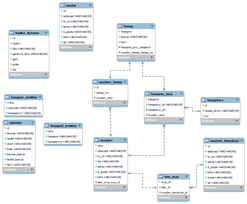

# Management System Of Bank(Banka Yönetim Sistemi )

Abstract---Bu projede bir bankanın yonetim sistemi ic¸in bir veritabanı
tasarlamanız ve bu veritabanının uzerinde gerekli is¸lemleri
gerc¸ekleyen bir uygulama gelis¸tirmeniz amac¸lanmaktadır.

Index Terms---banka yonetim sistemi,java gui,mysql , database processes

> I. GIRIS

Tasarlanan veritabanı, bankanın mus¸terilere, c¸alıs¸anlara, hesaplara
ve is¸lemlere ilis¸kin bilgileri organize bir s¸ekilde is¸lemesine
yardımcı olacaktır. Bu s¸ekilde bankanın ve mus¸terilerin ihtiyacı olan
bilgilere daha kolay ulas¸abilmesi saglanmıs¸ olacaktır. Ayrıca,
veritabanı kullanarak mus¸teri istekleri ve bankanın ihtiyac¸ları
dogrultusunda raporlar hazırlanabilecektir. Bir veritabanı tasarımının
ilk as¸amasında sistemin ihtiyac¸larının belirlenmesi ve depolanacak
bilgi turlerinin tanımlanması ic¸in Varlık-Ilis¸ki (ER) diyagramı
olus¸turulmalıdır. ER diyagramı sistem ic¸erisinde var olabile-cek
varlıkların ve aralarındaki ilis¸kilerin gorsel olarak ifade edilmesi
ic¸in kullanılır. Gelis¸tirme sırasında, ER diyagramı gereksinimlerin
daha ac¸ık ve ozlu bir s¸ekilde haritalanmasına yardımcı olmaktadır.
Sizlerden problemlerin c¸ozumu ic¸in bir veritabanı tasarımı yapmanız
istenmektedir. Tablo sayısı tum tablolar en az 3NF normalizasyon formuna
uyacak s¸ekilde size bırakılmıs¸tır. Projede olus¸turulacak
veritabanının ER diyagramının olus¸turulması ve arayuzde gosterilmesi
gerek-mektedir. Diyagram uzerinden gerc¸ekles¸tirilen normalizasyon
is¸lemlerinin adım adım gosterilmelidir. Veritabanı kesinlikle yazılım
sistemlerinin ayrılmaz bir parc¸asıdır. ER S¸emasını veritabanı
muhendisliginde tam olarak kullanmak, veritabanı olus¸turma, yonetim ve
bakımda kullanmak uzere yuksek kaliteli veritabanı tasarımı uretmenizi
garanti eder. Bir ER modeli ayrıca iletis¸im ic¸in bir arac¸ saglar.

ERD, ER S¸eması veya ER modeli olarak da bilinen Varlık Ilis¸ki S¸eması,
veritabanı tasarımında kullanım ic¸in bir tur yapısal diyagramdır. Bir
ERD, iki onemli bilgiyi gorselles¸tiren farklı semboller ve baglayıcılar
ic¸erir: Sistem kapsamındaki ana varlıklar ve bu varlıklar arasındaki
ilis¸kiler .

Is¸te bu yuzden buna "Varlık" "iliski" diyagramı (ERD) deniyor!

ERD'deki varlıklar hakkında konus¸tugumuzda, genellikle insanlar/roller
(orn. Ogrenci), somut is¸ nesneleri (orn. Urun), soyut is¸ nesneleri
(orn. Log), vb. gibi is¸ nesnelerinden bahsediyoruz. bu varlıklar sistem
ic¸inde birbirleriyle ilis¸kilidir.

Tipik bir ER tasarımında, varlıkları, niteliklerini ve aralarındaki
ilis¸kileri gosteren yuvarlak dikdortgenler ve baglayıcılar (uc¸larının
farklı stilleri olan) gibi semboller bu-labilirsiniz.

ER Diyagramları ne zaman c¸izilir? Peki, ERD'leri ne zaman c¸iziyoruz?
ER modelleri c¸ogunlukla kavram gorselles¸tirme ve fiziksel veritabanı
tasarımı ac¸ısından ilis¸kisel veritaban-ları tasarlamak ic¸in
gelis¸tirilmis¸ olsa da, ER diyagramlarının yardımcı olabilecegi bas¸ka
durumlar da vardır. Is¸te bazı tipik kullanım durumları.

> 1\) Veritabanı tasarımı - Degis¸imin olc¸egine baglı olarak, bir
> veritabanı yapısını dogrudan bir VTYS'de degis¸tirmek riskli olabilir.
> Bir uretim veritabanındaki verileri boz-mamak ic¸in degis¸iklikleri
> dikkatli bir s¸ekilde planla-mak onemlidir. ERD yardımcı olan bir
> arac¸tır. Veri-tabanı tasarım fikirlerini gorselles¸tirmek ic¸in ER
> diya-gramları c¸izerek, hataları ve tasarım kusurlarını be-lirleme ve
> veritabanındaki degis¸iklikleri uygulamadan once duzeltmeler yapma
> s¸ansınız olur.
>
> 2\) Veritabanı hata ayıklama - Ozellikle veritabanı, ihtiyacınız olan
> bilgiyi elde etmek ic¸in karmas¸ık SQL yazmayı gerektiren birc¸ok
> tablo ic¸erdiginde, veritabanı sorunlarını ayıklamak zor olabilir. Bir
> ERD ile bir veritabanı s¸emasını gorselles¸tirerek, tum veritabanı
> s¸emasının tam bir resmine sahip olursunuz. Varlıkları kolayca
> bulabilir, niteliklerini goruntuleyebilir ve bas¸kalarıyla olan
> ilis¸kilerini tanımlayabilirsiniz. Tum bunlar, mevcut bir veritabanını
> analiz etmenizi ve veritabanı sorunlarını daha kolay ortaya
> c¸ıkarmanızı saglar.
>
> 3\) Veritabanı olus¸turma ve yamalama - Bir ERD aracı olan Visual
> Paradigm, ER diyagramları aracılıgıyla veritabanı olus¸turma ve yama
> surecini otomatikles¸tirebilen bir ver-itabanı olus¸turma aracını
> destekler. Bu nedenle, bu ER Diyagramı aracıyla, ER tasarımınız artık
> yalnızca statik bir diyagram degil, fiziksel veritabanı yapısını
> gerc¸ekten yansıtan bir aynadır.
>
> 4\) Gereksinim toplamada yardım - Sistemin ust duzey is¸ nesnelerini
> gosteren kavramsal bir ERD c¸izerek bir bilgi sisteminin
> gereksinimlerini belirleyin. Boyle bir bas¸langıc¸ modeli, ilis¸kisel
> bir veritabanının olus¸turulmasına yardımcı olan veya surec¸
> haritalarının ve veri akıs¸ modlarının olus¸turulmasına yardımcı olan
>
> bir fiziksel veritabanı modeline de evrilebilir.

Varlık

Bir ERD varlıgı, bir kis¸i/rol (or. Ogrenci), nesne (or. Fatura), kavram
(or. Profil) veya olay (or. Is¸lem) gibi bir sistem ic¸indeki
tanımlanabilir bir s¸ey veya kavramdır (not: ERD'de " varlık" genellikle
"tablo" yerine kullanılır, ancak bunlar aynıdır). Varlıkları belirlerken
onları isim olarak dus¸unun. ER modellerinde, bir varlık, adı ustte ve
nitelikleri varlık s¸eklinin govdesinde listelenmis¸ olarak
yuvarlatılmıs¸ bir dikdortgen olarak gosterilir.

Varlık Ozellikleri

Sutun olarak da bilinen oznitelik, onu tutan varlıgın bir ozelligi veya
ozelligidir .

Bir ozniteligin, ozelligi tanımlayan bir adı ve bir dize ic¸in varchar
ve tamsayı ic¸in int gibi oznitelik turunu tanımlayan bir turu vardır.
Fiziksel veritabanı gelis¸tirme ic¸in bir ERD c¸izildiginde, hedef RDBMS
tarafından desteklenen turlerin kullanımını saglamak onemlidir.

Birincil anahtar

PK olarak da bilinen birincil anahtar, bir veritabanı tablosundaki bir
kaydı benzersiz olarak tanımlayan ozel bir tur varlık niteligidir .
Bas¸ka bir deyis¸le, birincil anahtar ozniteligi ic¸in aynı degeri
paylas¸an iki (veya daha fazla) kayıt olmamalıdır. As¸agıdaki ERD
ornegi, birincil anahtar ozniteligi 'ID' olan bir 'Urun' varlıgını ve
veritabanındaki tablo kayıtlarının onizlemesini gosterir. Uc¸uncu kayıt
gec¸ersiz c¸unku 'PDT-0002' kimliginin degeri zaten bas¸ka bir kayıt
tarafından kullanılıyor.

Yabancı Anahtar

FK olarak da bilinen yabancı anahtar, bir tablodaki birincil anahtara
yapılan bas¸vurudur . Varlıklar arasındaki ilis¸kileri tanımlamak ic¸in
kullanılır. Yabancı anahtarların benzersiz olması gerekmedigini
unutmayın. Birden c¸ok kayıt aynı degerleri paylas¸abilir. As¸agıdaki ER
Diyagramı ornegi, aralarında bas¸ka bir varlıga atıfta bulunmak ic¸in
bir yabancı anahtarın kullanıldıgı bazı sutunlara sahip bir varlıgı
gostermektedir.

Ilis¸ki

Iki varlık arasındaki ilis¸ki, iki varlıgın bir s¸ekilde birbiriyle
ilis¸kili oldugunu gosterir . Ornegin, bir ogrenci bir kursa kayıt
olabilir. Bu nedenle Student varlıgı Course ile ilis¸kilidir ve bir
ilis¸ki, bunlar arasında baglantı kuran bir baglayıcı olarak sunulur.

Kardinalite

Kardinalite, bir varlıktaki olası olus¸um sayısını, diger bir varlıktaki
olus¸um sayısıyla ilis¸kili olarak tanımlar . Ornegin, BIR takımın
BIRC¸OK oyuncusu vardır. Bir ERD'de mevcut oldugunda, Takım ve Oyuncu
varlıgı bire c¸ok ilis¸kisiyle birbirine baglıdır.

Bir ER diyagramında, kardinalite, baglayıcının uc¸larında bir kaz ayagı
olarak temsil edilir. Uc¸ yaygın kardinal ilis¸ki bire bir, bire c¸oga
ve c¸oktan c¸ogadır.

Bire Bir kardinalite ornegi

Bire bir ilis¸ki, c¸ogunlukla bilgiyi kısaca saglamak ve daha anlas¸ılır
kılmak ic¸in bir varlıgı ikiye bolmek ic¸in kullanılır. As¸agıdaki
s¸ekil bire bir ilis¸ki ornegini gostermektedir.

Bire C¸ok kardinalite ornegi

Bire-c¸ok ilis¸ki, X ve Y varlıkları arasındaki, X'in bir orneginin
birc¸ok Y ornegine baglı olabilecegi, ancak bir Y orneginin yalnızca bir
X ornegine baglı oldugu ilis¸kiyi ifade eder. As¸agıdaki s¸ekil
gosterilmektedir. bire c¸ok ilis¸kisine bir ornek.

C¸oktan C¸oka kardinalite ornegi

C¸oktan c¸oga ilis¸ki, X'in birc¸ok Y ornegine baglı olabilecegi iki
varlık X ve Y arasındaki ilis¸kiyi ifade eder ve bunun tersi de
gec¸erlidir. As¸agıdaki s¸ekil c¸oktan c¸oga ilis¸ki ornegini
gostermektedir. Fiziksel bir ERD'de c¸oktan c¸oga ilis¸kinin bir c¸ift
bire c¸ok ilis¸kiye bolundugunu unutmayın. Bir sonraki bolumde fiziksel
bir ERD'nin ne oldugunu bileceksiniz.

Bir ER modelinin uc¸ duzeyinin tumu, niteliklere ve ilis¸kilere sahip
varlıklar ic¸erirken, olus¸turuldukları amac¸lar ve hedeflemeleri
gereken hedef kitleler ac¸ısından farklılık gosterirler.

Uc¸ veri modeline ilis¸kin genel bir anlayıs¸, is¸ analistinin sistemde
var olan is¸ nesnelerini modellemek ic¸in kavramsal ve mantıksal bir
model kullanması, veritabanı tasarımcısı veya veritabanı muhendisinin
ise fiziksel durumu sunan fiziksel modeli uretmek ic¸in kavramsal ve
mantıksal ER modelini gelis¸tirmesidir.

Kavramsal veri modeli

Kavramsal ERD , bir sistemde olması gereken is¸ nesnelerini ve bunlar
arasındaki ilis¸kileri modeller . Ilgili is¸ nesnelerini tanıyarak
sistemin genel bir resmini sunmak ic¸in kavramsal bir model
gelis¸tirilmis¸tir. Hangi tabloların DEGIL, hangi varlıkların var
oldugunu tanımlar. Ornegin, mantıksal veya fiziksel bir veri modelinde
'c¸oktan c¸oga' tablolar mevcut olabilir, ancak bunlar kavramsal veri
modeli altında yalnızca kardinalitesi olmayan bir ilis¸ki olarak
gosterilir.

Mantıksal veri modeli

Mantıksal ERD, Kavramsal ERD'nin ayrıntılı bir surumudur . Her
varlıktaki sutunları ac¸ıkc¸a tanımlayarak ve operasyonel ve is¸lemsel
varlıkları tanıtarak kavramsal bir modeli zenginles¸tirmek ic¸in
mantıksal bir ER modeli gelis¸tirilmis¸tir. Mantıksal bir veri modeli,
veritabanının olus¸turulacagı gerc¸ek veritabanı sisteminden hala
bagımsız olsa da, tasarımı etkiliyorsa bunu yine de goz onunde
bulundurabilirsiniz.

Fiziksel veri modeli

Fiziksel ERD, ilis¸kisel bir veritabanının gerc¸ek tasarım planını
temsil eder . Fiziksel bir veri modeli, her bir sutuna tur, uzunluk,
null yapılabilir vb. degerler atayarak mantıksal

veri modelini detaylandırır. Fiziksel bir ERD, verilerin belirli bir
VTYS'de nasıl yapılandırılması ve ilis¸kilendirilmesi gerektigini temsil
ettiginden, veritabanının olus¸turulacagı gerc¸ek veritabanı sistemi.
Sutun turlerinin VTYS tarafından desteklendiginden ve varlık ve
sutunların adlandırılmasında ayrılmıs¸ sozcuklerin kullanılmadıgından
emin olun.

> II\. YONTEM

Problem Tanımı: Banka ic¸erisinde mus¸teri, temsilci ve banka muduru
olmak uzere 3 adet rol bulunmaktadır. Mus¸teriler ve c¸alıs¸anlar ic¸in
gerekli tanımlayıcı bilgiler (Ad Soyad, Telefon, TC No, Adres, E-posta)
veri tabanında saklanmalıdır. Bir mus¸terinin birden fazla hesabı
bulunabilir. Hesaplar sistem ic¸erisinde kayıtlı bulunan herhangi bir
para birimi cinsinden ac¸ılabilir (TL varsayılan olarak gelmelidir).
Hesaplar arası para transferinde gerekli durumlarda kur donus¸umu
otomatik olarak yapılmalıdır. Rollerin gerc¸ekles¸tirdigi eylemler
as¸agıda belirtilmis¸tir. Tum bu eylemlerin tasarlanan bir arayuz
uzerinden gorsel bir s¸ekilde gosterilmesi gerekmektedir. Sistemdeki
Roller: Mus¸teriler; o Hesaplarından para c¸ekebilirler ve
yatırabilirler. o Yeni hesap ac¸ma ve var olan bir hesabı silme
talebinde bulunabilirler. Bakiyesi "0" olmayan bir hesap silinemez. o
Birbirleri arasında para transferi yapabilirler. Farklı para birimlerine
sahip hesaplar arası transferler sırasında gonderilen miktar hedef para
birimine otomatik olarak c¸evrilmelidir. o Bilgilerini
guncelleyebilirler. (Adres, Telefon vs.) o Bankaya para transferi
yapabilirler. (Kredi borcu odeme) o Bankadan kredi talep edebilirler.
Kredi sadece TL cinsinden talep edilebilmektedir. Bankanın kredi
talebini onaylaması durumunda istenilen vade oranınca (faiz ve anapara
toplamı) bolunerek aylara borc¸ olarak yansıtılır. Aylık ozet
goruntulemede kredi borcu odemeleri ic¸in odenen faiz ve anapara ayrı
ayrı goruntulenmelidir. Mus¸terinin aylık borcunun tamamını odememesi
durumunda kalan borc¸ ek faiz hesaplanarak bir sonraki aya devreder.
Faiz ve gecikme faiz oranı banka muduru tarafından belirlenir. Aylık
borc¸ ve kalan borc¸ ayrı ayrı goruntulenmeli. (mus¸teri isterse tum
borcunu tek seferde odeyebilir) Erken odeme durumlarında gelecek aylar
ic¸in faiz alınmayacaktır. o Aylık ozetlerini goruntuleyebilirler.
(Gec¸erli ay ic¸erisinde yaptıgı para gonderme, c¸ekme, kredi borcu
odeme gibi is¸lemlerin ozeti) Banka muduru; o Bankanın genel durumunu
(gelir, gider, kar ve toplam bakiye) goruntuleyebilmektedir. o Yeni para
birimi (Dolar, Euro, Sterling vs.) ekleyebilir ve kur degerlerini
guncelleyebilir. o C¸alıs¸anların maas¸ ucretlerini belirleyebilecektir.
Tek bir c¸alıs¸an turu vardır (mus¸teri temsilcisi). Hepsinin maas¸
miktarı aynıdır. o Kredi ve gecikme faiz oranını belirler. o Mus¸teri
ekleyebilir. Sisteme yeni bir mus¸teri eklenmesi durumunda en az
mus¸teriye sahip olan temsilciye atanır. o Sistemi bir ay ilerletebilir.
Isterlerin test edilebilmesi ic¸in sizlerden uygulama tarihini bir ay
ileriye oteleyebilmeniz istenmektedir. Bu ilerletme is¸lemi sonucunda -¿
maas¸ların odenmesi, gelir-gider durumlarının guncellenmesi ve
mus¸terilerin bir sonraki

aya ait borc¸larının kendilerine yansıtılması gerekmektedir. o Bankada
gerc¸ekles¸en tum is¸lemleri (para c¸ekme, yatırma ve transfer)
goruntuleyebilmektedir. Is¸lemleri listelerken "son X adet is¸lemi
listele" s¸eklinde bir sec¸enek sunulmalıdır. Ornek olarak "son 5
is¸lemi listele" sorgusunun c¸ıktısı Tablo I'de gosterilmis¸tir. o
Listelenen is¸lemlerin aynı anda bas¸latılması durumunda deadlock
olus¸up, olus¸madıgının analizinin yapabilmektedir. Deadlock analizi
ayrı bolumde ac¸ıklanacaktır.

ALGORITMA :

Adım 1: Mus¸teri id bulan sorgu gonderilir

Adım 2: mus¸teri id'sinden hesap no bulan sorgu gonderilir Adım 3:
buradan hesap birim id bulan sorgu gonderilir

Adım 4: hesapturu tablosundan bakiyeyi bulan sorgu gonderilir

Adım 5: arayuzde c¸ek butonuna basıldıgında bakiye alınır Adım 6:
kullanıcının girdigi miktar alınır

Adım 7: kullanıcının girdigi miktar int degere donus¸turulur Adım 8:
bakiye miktar kontrolu yapılır

Adım 9: uygunsa bakiyeden miktar c¸ıkarılır Adım 10: bakiyeyi
guncelleyen sorgu gonderilir

> Fig. 1. Flame sensor uygulaması ornegi

Mus¸teri temsilcisi; o Her mus¸terinin bir temsilcisi vardır. o Mus¸teri
ekleme, silme ve duzenleme yapabilir (silme ve duzenleme is¸lemleri
sadece kendi mus¸terileri ic¸in gec¸erlidir). o Mus¸teri bilgilerini
guncelleyebilirler. (Adres, Telefon vs.) o Ilgilendikleri mus¸terilerin
genel durumlarını (gelir, gider ve toplam bakiye)
goruntuleyebilmektedir. o Mus¸terilerden gelen hesap ac¸ma, silme ve
kredi taleplerini goruntuleme ve onaylama sorumlulugu temsilcilere
aittir. o Ilgilendikleri mus¸terilerin is¸lemlerini (para c¸ekme,
yatırma ve transfer) goruntuleyebilmektedir. Deadlock Analizi: Para
gonderimi sırasında hedefin is¸lem yapması engellenmektedir. Bu nedenle

para almakta olan bir hesap para gonderimi yapamamaktadır. Deadlock
analizi ic¸in tum is¸lemlemlerin aynı anda c¸alıs¸maya bas¸ladıgı ve
paralel s¸ekilde c¸alıs¸tıgı kabul edilecektir.

> SONUC

Tasarlanan veritabanı, bankanın mus¸terilere, c¸alıs¸anlara, hesaplara
ve is¸lemlere ilis¸kin bilgileri organize bir s¸ekilde is¸lemesine
yardımcı olacaktır. Bu s¸ekilde bankanın ve mus¸terilerin ihtiyacı olan
bilgilere daha kolay ulas¸abilmesi saglanmıs¸ olacaktır. Ayrıca,
veritabanı kullanarak mus¸teri istekleri ve bankanın ihtiyac¸ları
dogrultusunda raporlar hazırlanabilecektir. Bir veritabanı tasarımının
ilk as¸amasında sistemin ihtiyac¸larının belirlenmesi ve depolanacak
bilgi turlerinin tanımlanması ic¸in Varlık-Ilis¸ki (ER) diyagramı
olus¸turulmalıdır. ER diyagramı sistem ic¸erisinde var olabile-cek
varlıkların ve aralarındaki ilis¸kilerin gorsel olarak ifade edilmesi
ic¸in kullanılır. Gelis¸tirme sırasında, ER diyagramı gereksinimlerin
daha ac¸ık ve ozlu bir s¸ekilde haritalanmasına yardımcı olmaktadır.

> REFERENCES
>
> \[1\] https://www.visual-paradigm.com/guide/data-modeling/what-is-entity-relationship-diagram/
>
> \[2\] https://www.guru99.com/database-normalization/
>
> \[3\] https://www3.ntu.edu.sg/home/ehchua/programming/java/ 
> 
> \[4\] https://www.javatpoint.com/java-swing
